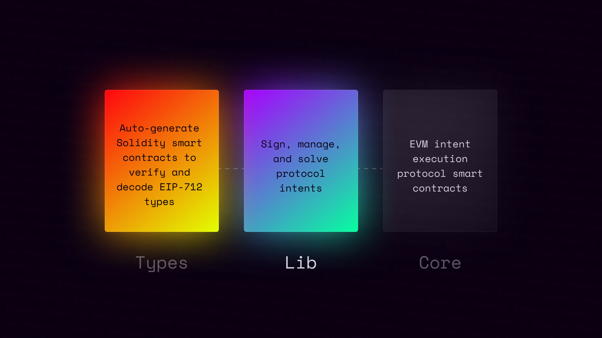

# Emporium Library



Emporium is the fastest way to get up and running with the a typesafe intent-based architecture in Typescript. Here you can find Solver and Signer mechanisms of Emporium to create, execute, and validate the state of parallel intent declarations and transactions. 

Without `Emporium`:

- 🚨 `.signTypedData()` returns a raw hex `type:string`.
- 🤔 `type:string` has none of the logical utilities of an `class:Intent`.
- 🤬 `.recover()` requires you manage signature parts and backend support.

With `Emporium`:

- 🧩 `.sign()` returns a typesafe version of a `class:Intent`.
- 🥹 `class:Intent` includes all the utilities of a typical intent protocol.
- ✅ `.recover()` automaticaly verify the `Signer` from in-memory cache.
- 🚀 and several more small helper utilities. 

Built using:

```ml
├─ abitype - "Parse EIP712 types to typesafe structs."
├─ ethers - "Complete and compact library for interacting with the Ethereum Blockchain."
└─ typescript - "You will find types for each piece to make working with the library simple."
```

## Getting Started

Getting up and running with the use of `Emporium` is incredibly straightforward. Built on top of Ethers, you can import the library into your existing codebase without need configuration, dependency dances, or managing the conflicts of trying to use dependencies that are not meant for both the browser & node environment.

### Installation

To install this library in your repository for personal use run:

```shell
pnpm i @nftchance/emporium-lib
```

### Basic Usage

In the beginning stages, you likely aren't going to want to extend the framework. With instant access to signing and management of `Delegation` and `Invocations` you can prepare your codebase for framework consumption in just a few lines:

```typescript
// * Prepare the EIP-712 domain metadata.
const metadata = ['Echo', '0.1.0']

// * Prepare your contract reference -- You can connect however you prefer.
// ! Echo is just an example, you will use your contract that 
//   extends the framework onchain here.
const contract = await (
    await ethers.getContractFactory('Echo')
).deploy(...metadata)

// * Instantiate the framework to handle your Intents.
const util = await new Framework(contract).init(...metadata)

// * Easily sign and manage the resulting body with type safety 
//   and access to the built-in utility functions.
const signedDelegation = await util.sign(owner, 'Delegation', {
    delegate: await owner.getAddress(),
    authority: ethers.ZeroHash as `0x${string}`,
    caveats: []
})
```